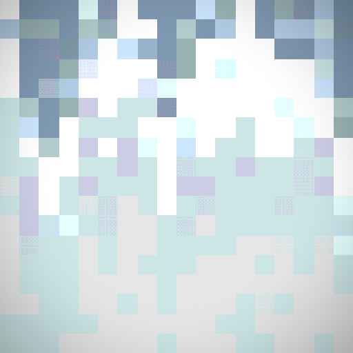
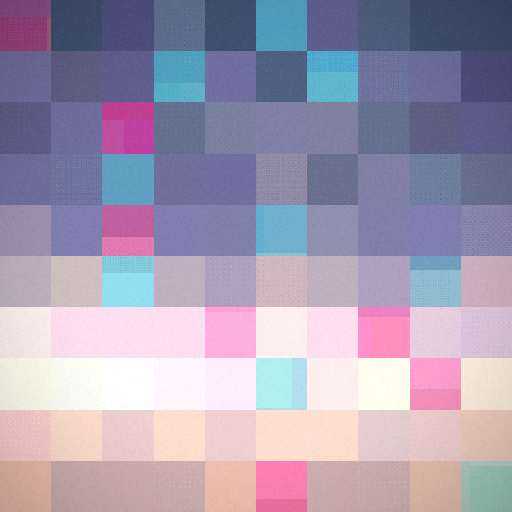

# lofi blue sky

> (っ◔◡◔)っ ♥ abstraction ♥
> a beautiful blue sky — i've been filming the sky for over a decade
> it is my meditation — sit with me and watch the sky go by
> ˜”°•.˜”°• hello •°”˜.•°”˜

**Version:** 0.7.0 · **License:** MIT · [Roadmap](./ROADMAP.md) · [Docs](./docs) · **Live:** https://cportka.github.io/lofi-blue-sky/

A procedurally generated **lofi sky**, synthesized entirely in a fragment shader from a hash. No
footage, no assets — a slow, meditative, seamless loop of a **clean grid of sky-pixels that pulse
in colour**, in the 1×1 → 2×2 → 4×4 → 1×N lineage the project grew out of. Same hash, same sky, on
every machine, forever.


_The same sky, five moments across one loop — the pixels pulse, the sky breathes:_


## The thesis

**The masterpiece is in the GLSL — one idea executed completely. The platform is the frame.**

One shared engine, two frames:

- **Target A — the fxhash token** (`targets/fxhash/`). A single, restrained slit-scan sunset,
  deterministic from `$fx.hash`, bundled into one **self-contained ~16 KB HTML** with no network
  and no external resources — small enough to store fully on-chain (ONCHFS). The disciplined
  masterpiece: it thrives inside fxhash's limits instead of fighting them.
- **Target B — breathe** (`targets/web/`). The generator with the cap off — for now, a small
  GitHub Pages preview of the live engine (randomize, paste a seed, save a frame). It grows into
  the full edition: all glitch modes, audio, high-res + video export.

Both are built from the **same GLSL core + the same genome** — two entry points, one shader set.

## The project

lofi blue sky is a long-running **internet art project** by Chris Portka (**djpants** ·
`djpants.eth`) — a decade of filming the sky, distilled into slow, glitched loops. This repo is the
generative engine; the wider project is a body of released animated skies:
[Website](https://lofibluesky.io/) ·
[OpenSea](https://opensea.io/collection/lofibluesky) ·
[objkt](https://objkt.com/collections/KT1LYDrLXqJBgrs414HjER6qTqAgre2moq3u) ·
[Paras](https://paras.id/lofibluesky.near) ·
[Instagram](https://www.instagram.com/lofi_blue_sky/) ·
[X](https://x.com/lofi_blue_sky).

See [docs/PROJECT.md](./docs/PROJECT.md) for the full picture and [the museum](./docs/MUSEUM.md) for
the library of released skies.

## Engines

One core, swappable **engines** — each a sky algorithm with its own hash→params key and shaders
([docs/ENGINES.md](./docs/ENGINES.md)):

- **Genesis** (above) — a grid of flat sky-pixels, **each exactly one colour, changing as one
  unit** (True Clean, ~90% of seeds — the 1×1 → 2×2 → 4×4 → 1×N lineage). The rare movements:
  **Clean Sweep** (the sun-bloom sweeping through the bars), **Distorted** (the smear + crush), and
  the <1% **Classic** — the original v1 slit-scan the first canonical picks live in. Canonical.
- **Billow** — rolling billowing clouds across a blue sky, near-clear to near-overcast, calm to
  gusty — clean 4 skies in 5. Young; carries the experimental Phase-4 mosaic mode.
- **Squall** — a clean pixel sky (every pixel breathing on its own phase) that a **rare squall of
  datamosh** sweeps through and clears (macroblock motion error, cyan/magenta chroma tearing).
  Young and experimental.


| Genesis — clean bars | Genesis — blue pixels | Genesis — the <1% classic | Squall — a passing squall |
|---|---|---|---|
|  |  |  |  |

## The look

Genesis: a sky is a grid of flat, exact **pixels** (`1×1 → 2×2 → 4×4 → 1×N`) sampled from a sunset
gradient at each cell's centre — so the **entire bar/pixel is one colour, and it changes as one
unit**, each cell on its own phase over a slow 20–34s seamless loop: the pixels of a low-res sky
video. A seed in the **True Horizon** window carries a crisp, always-distinguishable colour edge at
the horizon. The slit-scan smear and ordered-dither "bit-crush" survive only in the rare movements.
Muted, dusty, quantized palettes — Sodium, Powder, Olive, Periwinkle. See
[docs/AESTHETIC.md](./docs/AESTHETIC.md) and the [palette sheet](./assets/palettes/palettes.svg).

## Quickstart

```bash
npm install          # dev tooling only (typescript, esbuild) — zero runtime dependencies
npm test             # version sync + typecheck + deterministic unit suite + self-contained build
npm run build        # → targets/fxhash/dist/index.html (+ upload.zip) and ./index.html (Pages)
npm run render       # local: render in headless Chromium, verify determinism + seamless loop
```

Open `targets/fxhash/dist/index.html?fxhash=<any-hex>` or the root `index.html` in a browser.

## How it works

```
$fx.hash ─► genome (hash → params) ─► engine ─► sky.frag ─► slitscan.frag ─► post.frag ─► screen
            (deterministic DNA)                  gradient    drifting bands   dither/grain
```

- `packages/core/` — the platform-agnostic engine: a deterministic RNG, the genome, curated
  palettes, the WebGL2 pipeline, and the GLSL passes. Never imports `$fx` or the DOM UI.
- `targets/fxhash/` — wires `$fx` (hash · rand · features · preview) and builds the token bundle.
- `targets/web/` — the GitHub Pages generator UI.

Determinism is the whole game: **same hash → byte-identical params → byte-identical pixels**,
verified in CI and in a real browser. See [docs/DETERMINISM.md](./docs/DETERMINISM.md) and
[docs/ARCHITECTURE.md](./docs/ARCHITECTURE.md).

## Explore (the live generator)

On [the site](https://cportka.github.io/lofi-blue-sky/) (full-screen, always looping): **switch
engine** (Genesis / Billow / Squall) with the chips — the same seed reinterprets under it; **click
the sky** to hide/show the panel; **click any attribute** to reshuffle just that one; **◀ ▶**
undo/redo; **⧉** copies the seed and **↻** rolls a fresh one, side by side in the seed row (which
takes a pasted hash automatically). Save a frame with the OS screenshot. A hand-tweaked sky is
shared as an engine-tagged `g:<engine>:…` token. See [docs/CANON.md](./docs/CANON.md).

Two canonical seeds to try — both live in the <1% **Classic** golden window, rendering as the v1
slit-scan beauties they were first picked as:
`00f50f353cf56cfa55f3b32404db3196e7cef86e37bd4b0fbca9304a8dd6097f` (the degraded sodium sunset) and
`3ebed465933f11af41fb9f999635ca11ea55c1357cdcba0f3d4bc11f9de5ff64` (the olive sky).

## Status

**Genesis is canonical** — each seed's DNA (palette, horizon, bands, sun, loop) is locked by
[docs/CANON.md](./docs/CANON.md) + CI. v0.2.0 added the interactive generator; **v0.3.0** made
engines swappable and started **Billow** (rolling clouds); **v0.4.0** added the museum + fxhash
release path; **v0.5.0** opened the Genesis key with 2D pixel splits and added **Squall** (a
datamosh); **v0.6.0** turned the family toward clean pulsating pixel-grids; **v0.7.0** landed
**True Clean** — the entire bar/pixel as one colour changing as one unit, ~90% of Genesis — with
Clean Sweep / Distorted / Classic as the rare movements, a visualized **True Horizon**, livelier
Squall, wider Billow weather, and the museum's full gif grid (Genesis key → v4). Open design calls
are in [docs/DECISIONS.md](./docs/DECISIONS.md); the engine model is in
[docs/ENGINES.md](./docs/ENGINES.md).

---

_lofi blue sky is an art project by Chris Portka ([djpants](https://fxhash.xyz/u/djpants) ·
`djpants.eth`)._
