# Design log

The visual + design narrative of the generator, iteration by iteration, with saved stills in
[`assets/renders/`](../assets/renders). For the full technical changelog see
[CHANGELOG.md](../CHANGELOG.md); this is the *look* and the *why*. For the released video-loop
editions that seeded the aesthetic, see the [museum](./MUSEUM.md).

## Source inspiration

The look is reverse-engineered from a handful of the project's own sky loops (see
[AESTHETIC.md](./AESTHETIC.md) and [`assets/skies/`](../assets/skies)):

- **`32__OG`** — horizontal slit-scan sunset → **Genesis**.
- **`35`** — datamosh powder-blue sky + salmon clouds → seeded **Billow** / future sort mode.
- **`31`** — olive/mauve downsample mosaic → the experimental **mosaic** mode.
- **`13`** — cyan/magenta macroblock datamosh → **Squall** (v0.5.0).
- grids & quadrants across the collection → Genesis v2's grid/block splits (v0.5.0).
- the dusty pixelated inspiration gif → the **Periwinkle** palette family.

---

## v0.1.0 — Genesis: the slit-scan sunset

The first light. One idea executed completely: a sunset gradient quantized into drifting horizontal
bands (a venetian-blind slit-scan), over curated dusty palettes (Sodium / Powder / Olive /
Periwinkle), finished with ordered dither, posterize, chromatic bleed, grain, and a vignette.
Deterministic from a hash; seamless 20–34s loop.

| periwinkle dusk | sodium sunset |
|---|---|
| 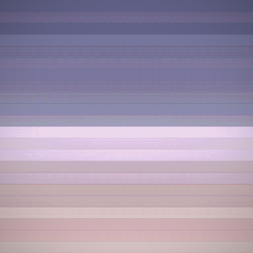 | 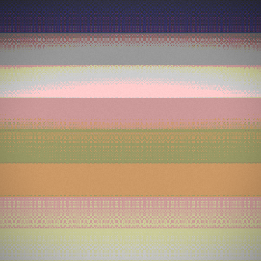 |

_The same sky drifting across one loop:_

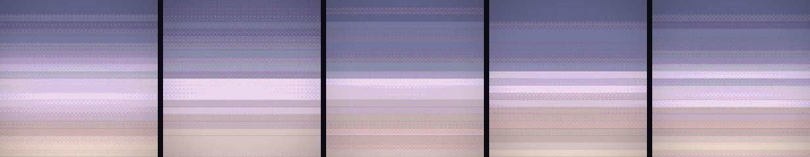

Palette DNA: [`assets/palettes/palettes.svg`](../assets/palettes/palettes.svg).
**Canonized and frozen** — every Genesis seed regenerates byte-identically ([CANON.md](./CANON.md)).

## v0.2.0 — the generator learns to play

No pixel change to Genesis — this was the *instrument*: a full-screen browser generator with a live
seed box, **click-an-attribute to reshuffle** just that trait, ◀ ▶ undo/redo, copy, PNG + **WebM
loop** export, and `g:` genome tokens for hand-tweaked skies. Olive made rarer in exploration (not
in the genome). The two rare feature flags (Perfect Horizon, Full Corruption) widened so they vary.
The reshuffle/branch mechanic here is what makes an fxhash **Open-form** token a natural fit
([fxhash.md](./fxhash.md)).

## v0.3.0 — engines, and a second sky

The generator became **multi-engine** — sky algorithms are swappable, each with its own key. Genesis
migrated in unchanged. And the second engine arrived:

**Billow** — rolling billowing clouds sweeping across a blue sky, procedural periodic FBM with an
integer-wind horizontal drift and a time-circle domain-warp churn (seamless). Plus the experimental
Phase-4 **mosaic** mode (the `31` downsample look).

| Billow — clouds | Billow — mosaic (experimental) |
|---|---|
| 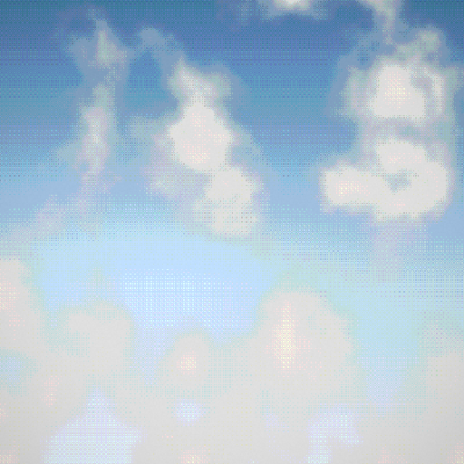 | 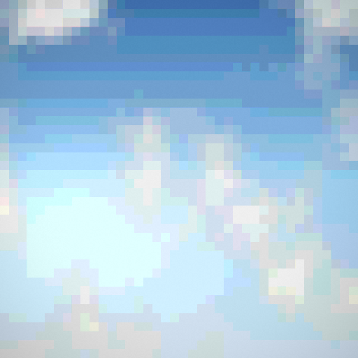 |

Genesis's key was *opened a little* (4 reserved draws) with **zero pixel change** to any seed.

## v0.5.0 — Genesis grows a second axis; a third engine

Everything this round grew out of a full look at the released loops now sitting in
[`assets/skies/`](../assets/skies): grids and quadrants dominate the collection, clean bars recur
(#19, #21), and #13 is pure cyan/magenta datamosh.

**Genesis v2 — clean finish + 2D pixel splits.** The classic single-column slit-scan is still the
preferred look (~56% of seeds), but Genesis can now split the sky into a `hbands × bands` **grid**,
render a **clean** finish (crisp flat bars/pixels, no drift or smear), or a square **block** mosaic.
The trick that made this safe on a canonical engine: the new geometry is derived from what were the
first two *reserved* draws, so every field up to `loopSeconds` is byte-identical and each seed keeps
its **DNA** — the finish/geometry just overlays. `keyVersion` bumped 1 → 2; the canonical picks were
re-blessed (`00f50f` now a clean sunset, `3ebed4` a 26-column grid).

| clean bars | grid (a sunset triptych) | block mosaic |
|---|---|---|
| 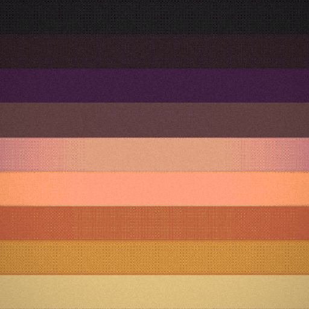 | 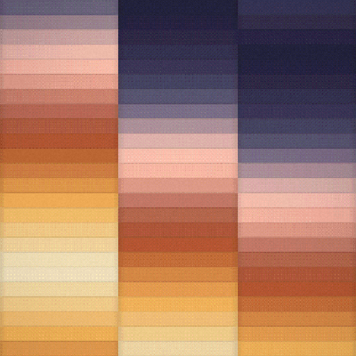 | 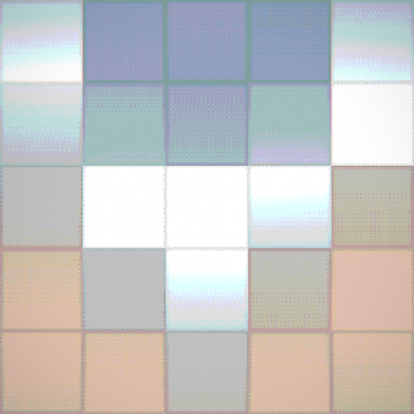 |

**Squall — a third engine (stateless datamosh).** From #13: a calm sky that a *squall* of signal
corruption sweeps through and clears, seamlessly, over the loop. Macroblocks hold displaced samples
and snap on a held-frame cadence; the R/B channels separate into the cyan/magenta datamosh split;
heavy blocks flood toward each palette's hot/cold corruption duo. It's all a periodic function of
loop phase (the envelope is exactly 0 at the seam), so it's seamless with no feedback history.

| datamosh (mid-squall) | signal lost |
|---|---|
| 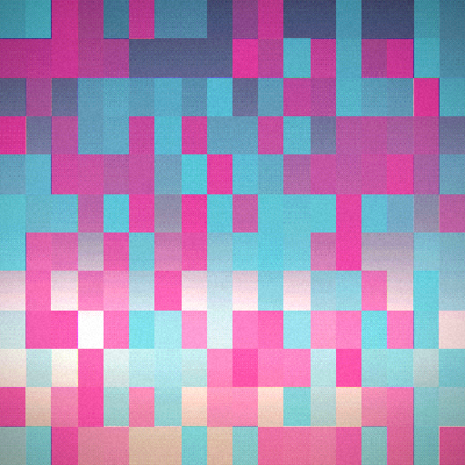 | 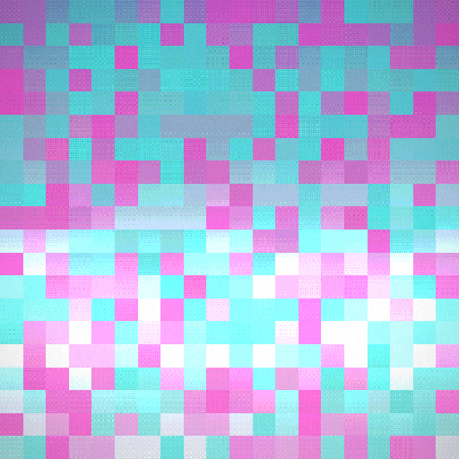 |

And the HUD was decluttered — the WebM loop and png buttons removed, "new sky" folded into a bare ↻
in the seed row.

## v0.6.0 — the pixels come home (clean, and pulsing)

A correction and a homecoming. v0.5's Genesis leaned on the *distorted* look — most seeds carried
the ordered-dither bit-crush — and the clean mode had accidentally switched the motion **off**, so
clean skies sat there stationary. v0.6 puts the project back on its origin: **lofi blue sky began as
a single 1×1 sky-pixel pulsing with colour, then 2×2, 4×4, 1×9 …** — clean because the pixels are
*exact*, just multiplied up.

So now a sky is a grid of flat, exact pixels whose colour **pulses** over the loop — the sample
slides up and down the sunset gradient, and with the crush pulled down each pixel reads as a clean,
breathing block of colour. Clean is the default (~75%); the venetian-blind smear + bit-crush is the
rare, distorted minority. The hero and filmstrip above were re-shot to this look.

| clean pixel blocks (the hero) | clean bars | blue pixels |
|---|---|---|
| 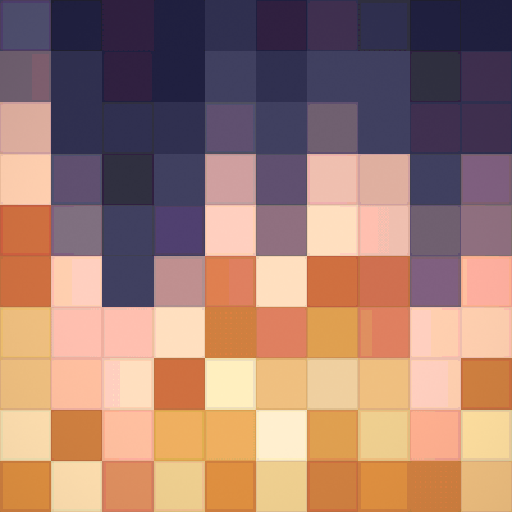 | 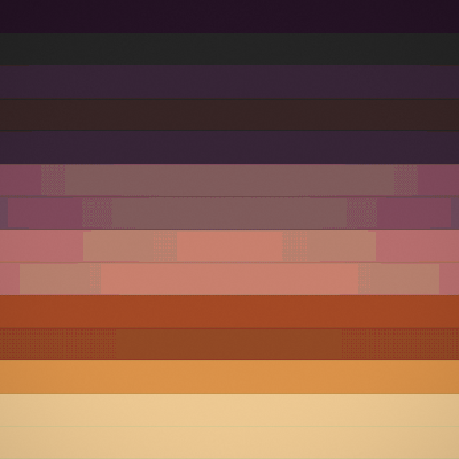 | 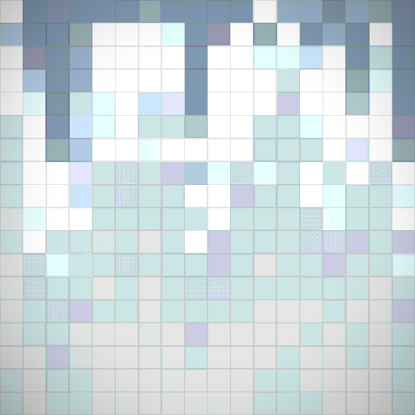 |

The same correction rippled out: **Squall's** calm base became a clean grid of pulsing pixels with
the datamosh as a rare passing spike (not a constant wash), and **Billow** dropped most of its crush
to clean, smooth clouds. Genesis's key went to **v3**, Squall and Billow to **v2** — all DNA-stable
where it could be, re-blessed where it couldn't.

| Squall — a passing squall | Billow — clean clouds |
|---|---|
| 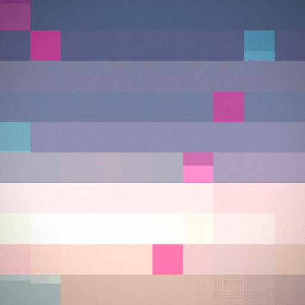 | 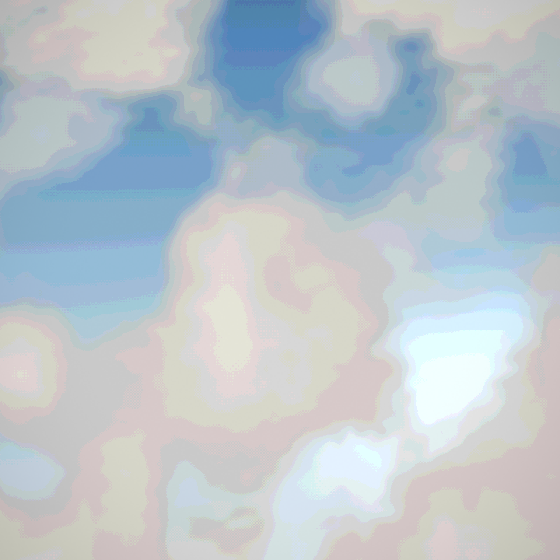 |

## v0.7.0 — True Clean (the bar IS the pixel), and movements

v0.6's clean bars had a tell: the sun-bloom's horizontal gradient bled through each bar, so a bar
was a glowing *slice* of sky, not a pixel. v0.7 fixes the metaphor at the root — every cell now
samples the gradient at its cell **centre on both axes**, so the **entire bar/pixel is exactly one
colour and changes as one unit**, each cell on its own phase. The v0.6 look was too beautiful to
delete, so Genesis now has **movements**:

| movement | share | what it is |
|---|---|---|
| **True Clean** | ~90% | flat one-colour cells changing as units — the sky |
| **Clean Sweep** | ~6% | the preserved v0.6 look — the sun-bloom sweeping through flat bars |
| **Distorted** | ~4% | the venetian-blind smear + full bit-crush |
| **Classic** | <1% | the original v1 slit-scan, in a golden window of the key that deliberately holds the two original canonical picks — they render as the v1 beauties they were first loved as |

**True Horizon** (né Perfect Horizon) is now visualized, not just labelled: seeds in the window get
a crisp colour edge pushed into the gradient exactly at the horizon — in True Clean it lands
between two pixel rows, always distinguishable.

| the hero — true pixels | classic (canon 00f50f) | true clean bars |
|---|---|---|
| 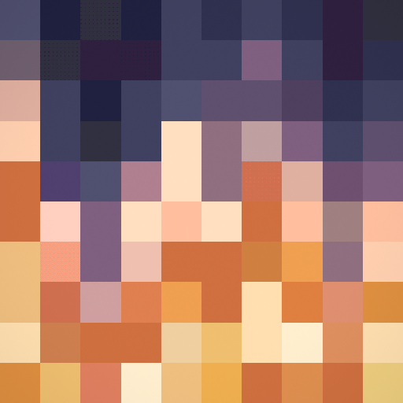 | 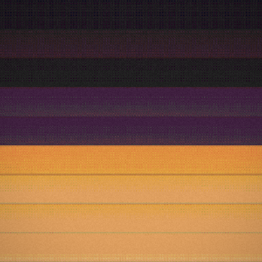 | 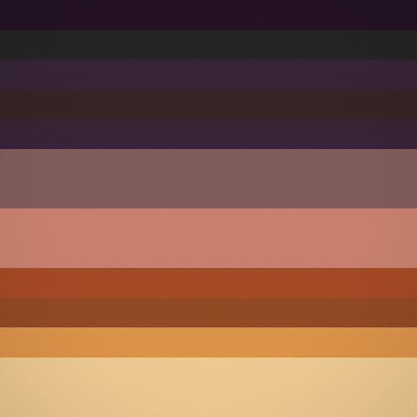 |

**Squall** got the movement it was missing — pulse amplitude/cycles lifted, per-pixel phase, harder
corruption when it lands. **Billow** got weather — coverage from near-clear to near-overcast, wind
1–4, and an explicit 80/20 clean/distorted finish. And the **museum** now shows all 23 released
gifs as an animated grid.

## v0.8.0 — the 1×1 origin, the squall's wind, and a cloud taxonomy

**Genesis came all the way home.** The original lofi blue sky was a single 1×1 pixel pulsing with
colour — so now **half of all Genesis skies are exactly that**: the entire frame is one pixel, its
colour journeying deep through the gradient over the loop (the deepest pulse in the family). The
featured filmstrip is now a 1×1 sky — five moments of one colour becoming another:

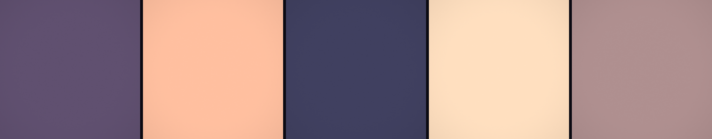

**Squall earned its name.** When the burst envelope swells, big wind drags whole rows of blocks
sideways in held, snapping shears — the long horizontal datamosh smears of the reference loops —
and waves bend the frame, all of it clearing to a calm pixel sky at the seam.

**Billow became a taxonomy.** Twenty named cloud types, each a parameter recipe the genome draws
inside: thin stretched Cirrus, lens-smooth Lenticularis, wave-rowed Undulatus, soft Fog, grey
Nimbostratus sheets, up to the dark churning **Cumulonimbus** storm tower. Two new shader axes —
horizontal *stretch* and storm *darken* — carry the variety.

| Squall — waves mid-burst | Cumulonimbus | Lenticularis | Cirrus |
|---|---|---|---|
| 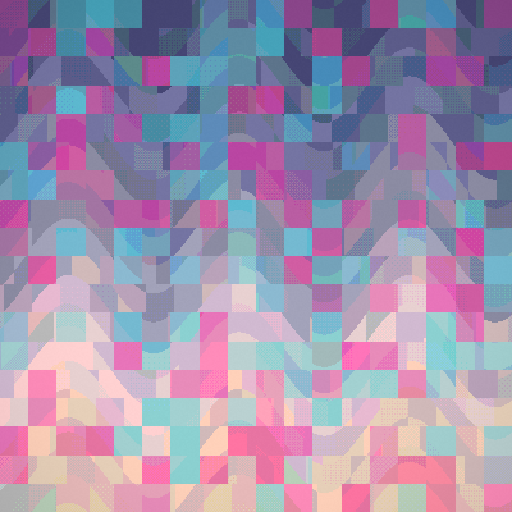 | 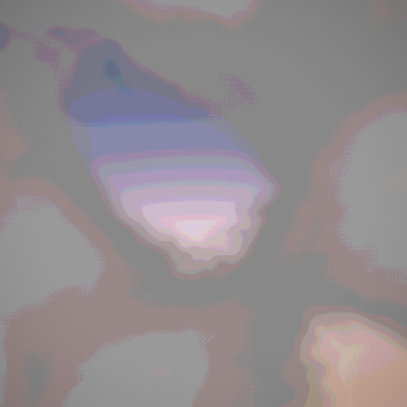 | 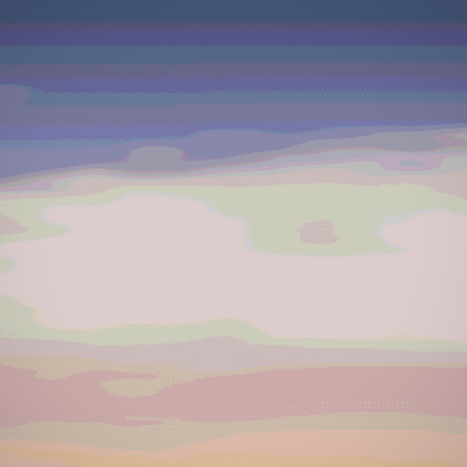 | 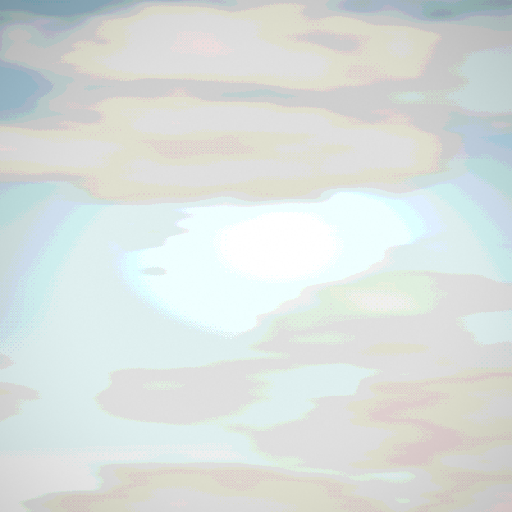 |

---

## Adding an entry

When a change alters the look (a new engine, a new mode, a palette pass): render a labeled still
into `assets/renders/` (`node scripts/render.mjs frame <hash>` → copy from `.captures/`), then add
a section here with the image and a sentence on the intent. Keep the stills small and representative.
